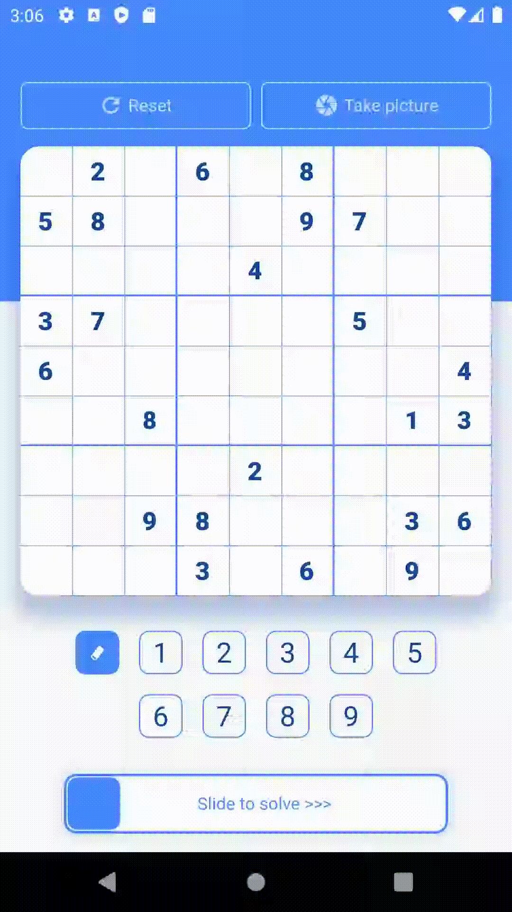

# Flutter Sudoku Solver

Sudoku Solver is a simple Flutter application to get the solution to Sudoku puzzles. It uses a backtrack search algorithm to find the solution. The algorithm is performed on a separate isolate because complex puzzles can take a few seconds to solve.

It is also fully responsive and works in vertical and horizontal orientations.

Any contributions are welcome.

